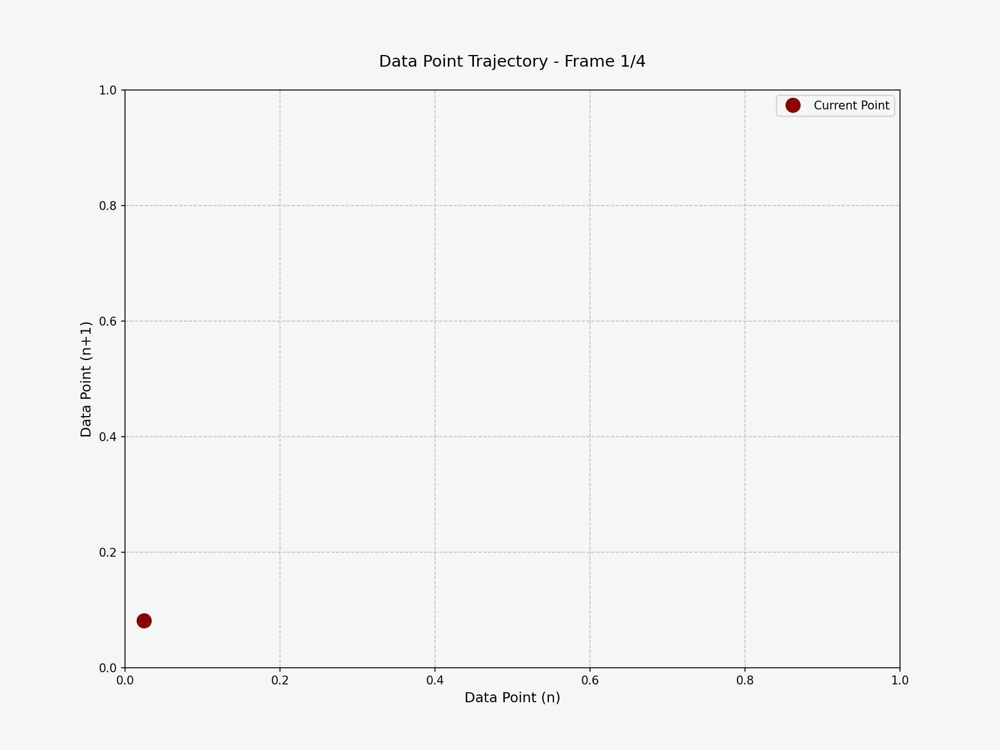
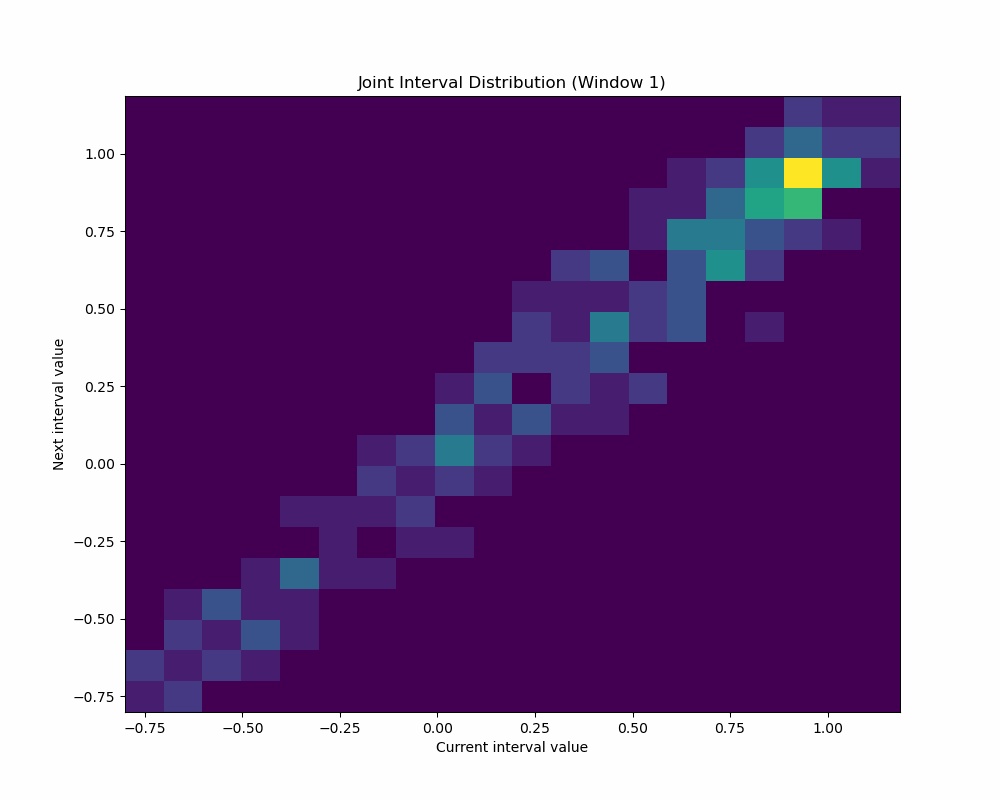

# Time Series Pattern Analysis: Smartphone Behavioral Data Visualization

## About CodeLAB

CodeLAB is a research laboratory within the Cognitive Psychology Department at Leiden University that focuses on analyzing smartphone behavioral patterns through data science methodologies. The lab bridges psychology and computational analysis to understand how people interact with their smartphones and what these interactions reveal about cognitive processes, attention patterns, and behavioral tendencies.

The research at CodeLAB combines psychological theory with advanced computational techniques to extract meaningful insights from digital behavioral data. This interdisciplinary approach allows researchers to discover patterns that would be impossible to detect through traditional psychological research methods alone.

While at CodeLAB, my specific focus was on developing innovative data visualization techniques for time series analysis, creating tools that could help researchers better identify patterns, transitions, and dynamics that might otherwise remain hidden in complex sequential datasets.

## Smartphone Data Research & Visualization

Smartphone data research represents a cutting-edge approach to understanding human behavior by leveraging the rich, continuous data streams that smartphones generate. This research area:

- **Captures naturalistic behavior**: Unlike laboratory experiments, smartphone data reflects real-world behavior in users' natural environments.
- **Provides high temporal resolution**: Data can be collected at the millisecond level, allowing for detailed analysis of behavioral patterns over time.
- **Enables comparison between self-reported and actual usage**: Research can uncover discrepancies between how people think they use their devices versus their actual usage patterns.
- **Reveals behavioral signatures**: Patterns of smartphone interaction can be linked to psychological states, cognitive traits, and even mental health indicators.
- **Allows for longitudinal analysis**: Changes in behavior can be tracked over extended periods, revealing developmental trends and responses to environmental changes.

## Visualization Techniques

This repository showcases advanced time series visualization techniques I've developed to analyze sequential data patterns, with particular application to smartphone interaction data. These visualizations transform temporal data into intuitive spatial representations that reveal hidden patterns and dynamics.

### Featured Visualizations

#### Line Tail Animation

The Line Tail visualization transforms time series data into a dynamic phase space representation by plotting each data point against its immediate successor (value at time n versus value at time n+1), creating a coordinate system that reveals relationship patterns impossible to see in traditional time series plots. As the animation progresses, it traces the trajectory of these paired values with a color-gradient tail that shows the recent path through this phase space, making recurring patterns, cyclical behaviors, and transition zones immediately apparent to viewers. This technique is particularly valuable for analyzing complex systems like psychological or physiological data streams, where subtle regime shifts, attractor states, and behavioral changes need to be identified.

This is another line tail animation example with a bigger dataset and adjusted window, bin, and step sizes.

#### Flow Field Analysis

The Flow Field visualization extends beyond individual trajectories by transforming time series data into a comprehensive vector field that represents the typical direction and magnitude of movement between consecutive points throughout the entire phase space. By calculating velocity vectors between sequential data points and then interpolating these vectors across regions with sparse or no data, the flow field reveals the underlying "force" patterns that govern how the system typically evolves from any given state. When rendered as streamlines, this visualization exposes critical dynamical features such as stable attractors (where streamlines converge), repellers (where streamlines diverge), saddle points (transition regions between different attractors), and basins of attraction (regions where all trajectories lead to the same attractor).

#### Joint Interval Distribution (JID)

The Joint Interval Distribution (JID) visualization quantifies the statistical relationships between consecutive values in a time series by creating a 2D histogram that maps transition frequencies, with the current value on one axis and the subsequent value on the other. Unlike the previous visualizations that focus on trajectories and dynamics, the JID reveals the probability structure of transitions, with bright areas indicating frequently occurring transitions and dark areas showing rare or impossible transitions in the system's evolution. This visualization is particularly powerful for identifying multimodal dynamics, where the system has multiple distinct behavioral states, as these appear as separate "islands" or clusters of high intensity in the distribution.

## Technical Implementation

The code in this repository demonstrates my ability to:

- Implement advanced data visualization techniques using Python and libraries such as Matplotlib, NumPy, SciPy, Pandas, h5py, and Collections (deque)
- Create dynamic visualizations that reveal temporal patterns in complex data
- Apply sophisticated mathematical techniques like vector field interpolation and joint probability distribution analysis
- Develop customizable visualization functions with comprehensive documentation
- Process and transform raw time series data into meaningful visual representations

## Applications

These visualization techniques have broad applications beyond smartphone research, including:

- Analysis of physiological signals (EEG, heart rate variability)
- Financial time series analysis
- Climate data pattern detection
- Behavioral economics research
- Any field where understanding sequential relationships and state transitions is valuable
